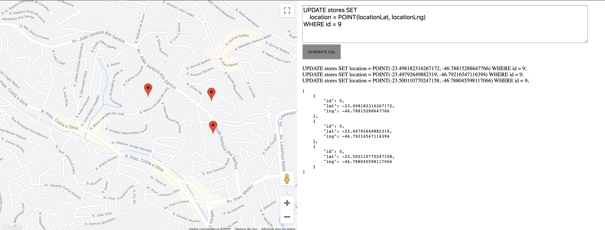

# Geo-Generator   

Create pointers in map (Lat/Lng) By clicking and get array|sql-stmt of this pins ;)   

### Demo-Online:  
https://gabrieldarezzo.github.io/maker-map/


## Screen-Demo:  



### Install in Local 

#### (SSH)
```bash
git clone git@github.com:gabrieldarezzo/maker-map.git
```
#### (HTTPS)
```bash
git clone https://github.com/gabrieldarezzo/maker-map.git
```


#### Install npm's needs
```bash
cd maker-map
npm install
```

### Up server Local to check demo (default use localhost:8888)
```bash
npm start
```
